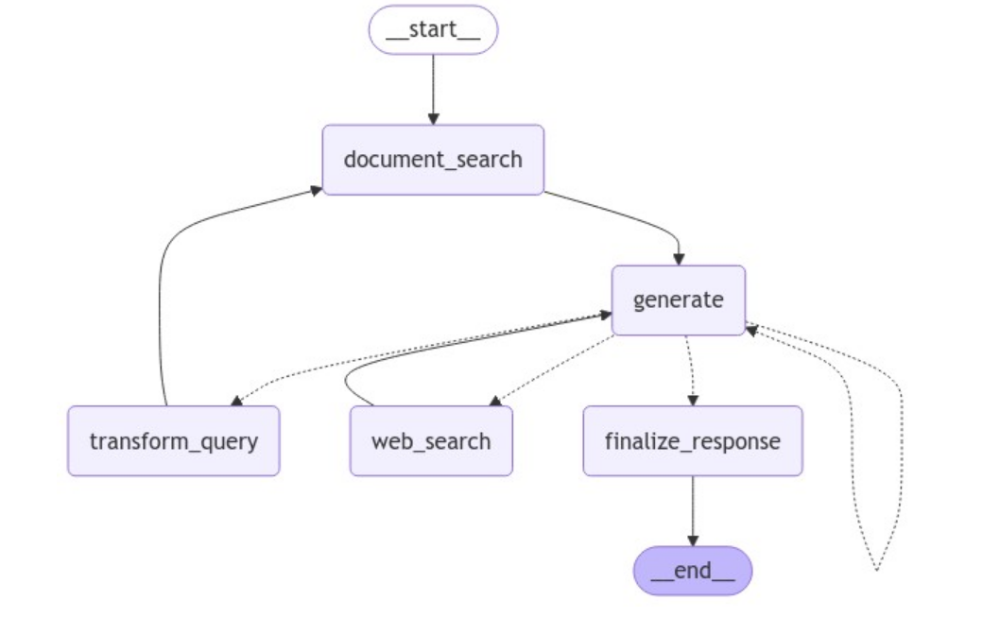
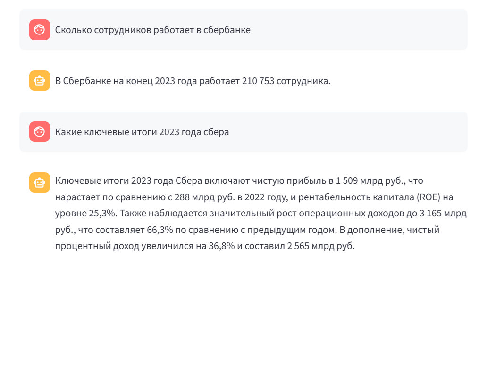
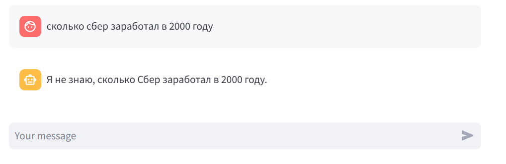

# Multimodal self-reflective RAG on Sberbank year reports

## Описание проекта

Этот проект представляет собой чат-бота, который отвечает на вопросы по годовому отчету Сбера за 2023 год, при необходимости модифицируя пользовательский запрос и добавляя в контекст результаты, найденные тулом Tavily Search. Идея решения взята из статьи "[Corrective Retrieval Augmented Generation](https://arxiv.org/pdf/2401.15884)" и адаптирована для использования в данном контексте. 

Решение реализовано с использованием фреймворка **LangGraph** и схема графа выглядит следующим образом:



## Структура проекта

Проект разделен на несколько ключевых директорий:

```plaintext
sber-reports-rag/
│
├── data/                      # Папка с данными
│   ├── interim/               # Промежуточные данные
│   │   ├── images/            # Изображения, извлеченные из pdf
│   │   ├── texts/             # Тексты с описаниями изображений
│   ├── raw/                   # Сырые данные (сам отчёт в pdf)
│   ├── vectorstore/           # Хранилище с векторами документов
│
├── notebooks/                 # Jupyter-ноутбуки с экспериментами
│
├── sber_reports_rag/          # Основной исходный код проекта
│   ├── backend/               # Логика работы бэкенда 
│   ├── data/                  # Логика предобработки данных
│   ├── utils/                 # Вспомогательные функции и промпты
│   ├── streamlit_app.py       # Реализация UI
│
├── assets/                     # Медиа-файлы для проекта
│
└── README.md                   # Описание проекта
```

## Подготовка данных и создание векторного хранилища

1. **Сбор документов**:
   Сначала необходимо исходный файл с названием `Сбер 2023.pdf` положить в `data/interim/texts/`. 

2. **Создание векторного хранилища**:
   После этого, выполните следующую команду для создания векторного хранилища:

   ```bash
   python -m sber_reports_rag/data/data_preparation.py
   ```

   Этот шаг создаст векторную базу и сохранит эмбеддинги документов в папке `data/vectorstore/`.

## Запуск приложения

Для запуска Streamlit приложения выполните следующие шаги:

1. Убедитесь, что все зависимости установлены:

   ```bash
   pip install -r requirements.txt
   ```

2. Запустите приложение Streamlit:

   ```bash
   streamlit run sber_reports_rag/streamlit_app.py
   ```

3. Перейдите в браузер и откройте локальный хост по адресу:

   ```plaintext
   http://localhost:8501
   ```

   Теперь вы сможете взаимодействовать с чат-ботом и задавать вопросы.

## Пример использования

После запуска приложения вы сможете задать свой вопрос, и система сгенерирует ответ на основе информации, найденной в документах или в случае, если после 3х переформулировок запроса ничего подходящего не сгенерировалось, то найденной с использованием двужка. Ниже приведены примеры взаимодействия:

1. 
   
   

2. 
   
